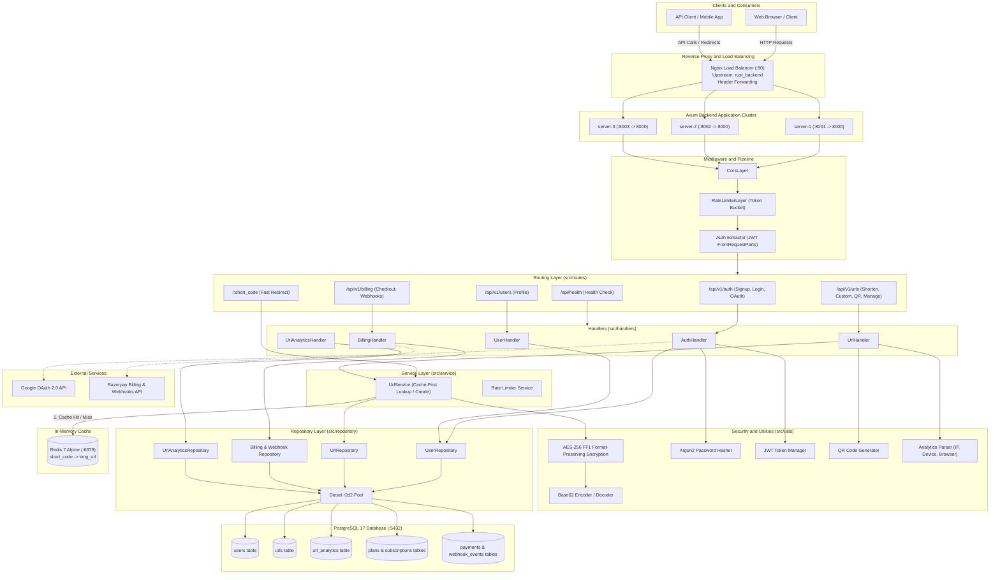

# Logpose - URL Shortener

> *Log Pose points your users straight to their destination.*

Logpose is a high-performance, scalable URL shortener built with Rust, the Axum framework, Diesel ORM, PostgreSQL and Redis. This project follows a clean, multi-layered architecture in Rust influenced by Domain-Driven Design (DDD) patterns. Requests enter through the route definitions in `src/routes/` and are forwarded to controllers in the handlers layer under `src/handlers/`. Business and database query logic is decoupled from routes and handled in `src/repository/` using the Diesel ORM, while database structures and request/response payloads live in `src/models/`.

I have implemented Redis caching using the `redis` crate. I am using `redis::aio::ConnectionManager`, which automatically reconnects upon Redis restarts or failures, and gracefully falls back to the database whenever Redis is inactive. The application state is wrapped inside an `Arc<AppState>`, which shares the Redis ConnectionManager, PostgreSQL ConnectionManager (`r2d2`), and other shared state variables across the backend.

For short code generation, I chose a base conversion approach. When a URL is inserted into PostgreSQL, the row index is retrieved via PostgreSQL's `SERIAL` type. The database index is then obfuscated and shifted using AES-256 Format-Preserving Encryption (FF1), and converted into a 4-letter base62 short code before being saved to the database. During lookup, this process is reversed to achieve $O(1)$ time complexity. This approach is completely collision-free, so there is no need for collision resolution overhead.

When a user opens `/{short_code}`, they are temporarily redirected. The redirect handler spawns an asynchronous background task (via Tokio) that extracts and logs click analytics—including IP address, user agent, browser, device, and referrer—without delaying the redirect response.

The database is indexed by the serial ID, the short code for rapid lookups, and by email in the users table. Using Diesel ORM allows writing type-safe queries in Diesel's DSL rather than raw SQL, while Diesel takes care of query generation, execution, and error handling.

For networking and security, Nginx is configured as a reverse proxy load balancer using round-robin distribution across multiple app instances. Nginx also forwards client headers (`X-Real-IP`, `X-Forwarded-For`), which are required by the downstream Token Bucket rate limiter so it inspects real client IP addresses instead of the proxy's IP. Authentication and security are handled using JWT and Argon2id for password hashing, along with Google OAuth 2.0 login. In addition to automatic short code generation, the service supports 6–30 character custom aliases, instant QR code generation, guest shortening with cookie persistence and automatic registration claiming, as well as a tiered subscription model (Free, Pro, Enterprise) integrated with Razorpay for checkout orders, subscription management, and webhook reconciliation.

Moving forward, I am planning features like database sharding and magic link login/signup methods.



```bash
# Debug build 
cargo build 

# Release build 
cargo build --release 

# Test
cargo test 

# Linting and formatting 
cargo fmt && cargo clippy --fix 
```

Run in Docker:

```bash
docker compose up -d 
```

## References & Crates Used

* [axum](https://crates.io/crates/axum) - Ergonomic and modular web application framework for Rust.
* [tokio](https://crates.io/crates/tokio) - Asynchronous runtime for the Rust programming language.
* [razorpay-rs](https://crates.io/crates/razorpay-rs) - Client SDK for integrating Razorpay payment and subscription APIs.
* [diesel](https://crates.io/crates/diesel) - Safe, extensible ORM and Query Builder for Rust.
* [redis](https://crates.io/crates/redis) - Redis client library for Rust with async and connection manager support.
* [fpe](https://crates.io/crates/fpe) - Format-Preserving Encryption (FF1 mode) implementation.
* [aes](https://crates.io/crates/aes) - Pure Rust implementation of the Advanced Encryption Standard.
* [base62](https://crates.io/crates/base62) - Fast Base62 encoder and decoder for URL-safe identifiers.
* [jsonwebtoken](https://crates.io/crates/jsonwebtoken) - JSON Web Token (JWT) implementation in Rust.
* [argon2](https://crates.io/crates/argon2) - Password hashing algorithm adhering to the PHC string format.
* [woothee](https://crates.io/crates/woothee) - User-agent string parser for browser, OS, and device classification.
* [tower-http](https://crates.io/crates/tower-http) / [tower](https://crates.io/crates/tower) - Modular HTTP middleware (CORS, rate limiting, service abstractions).
* [tracing](https://crates.io/crates/tracing) & [tracing-subscriber](https://crates.io/crates/tracing-subscriber) - Structured logging and diagnostics framework.
* [reqwest](https://crates.io/crates/reqwest) - Ergonomic HTTP client for third-party service calls and payment APIs.
* [oauth2](https://crates.io/crates/oauth2) - Strongly-typed Rust OAuth2 client library for Google authentication.
* [qrcode](https://crates.io/crates/qrcode) - QR code encoder for generating quick-access QR codes.
